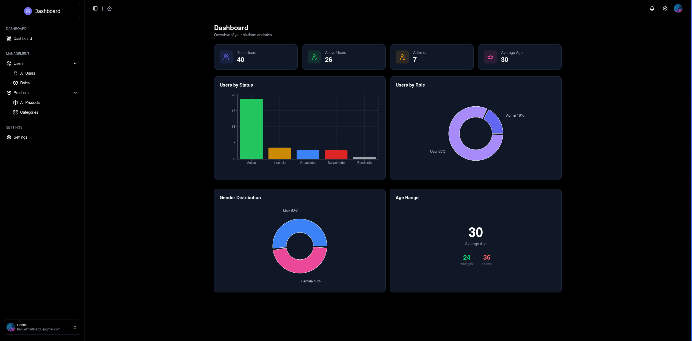
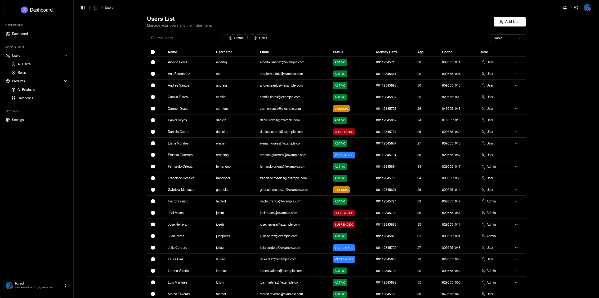
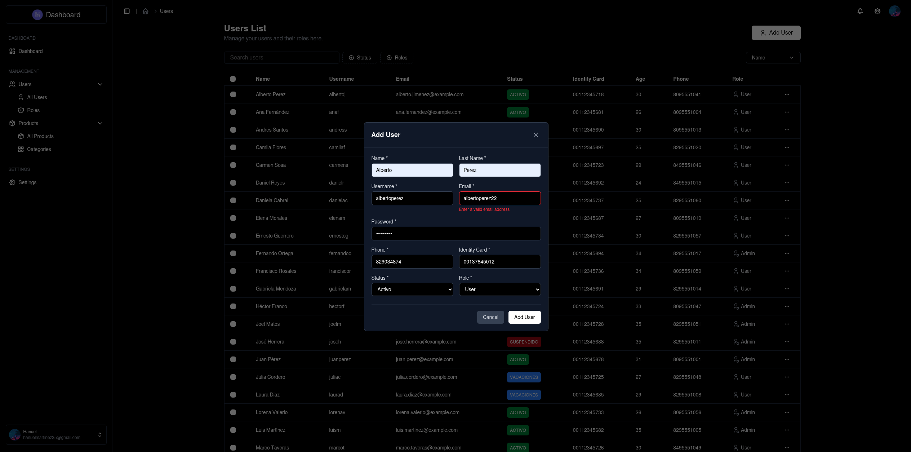
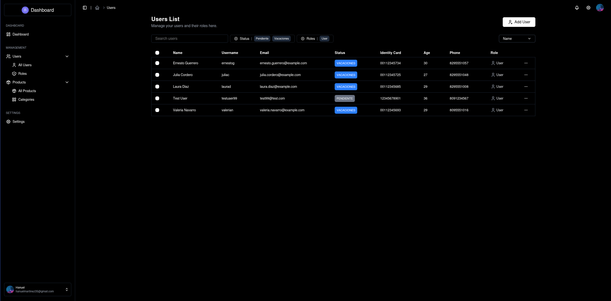

# Admin Dashboard

A full-stack admin dashboard for managing users with analytics, built with React 19 and a custom PHP backend.


> **Status:** In progress






## Features

- **User Management** — Full CRUD with multi-select bulk delete
- **Dashboard Analytics** — Real-time stats with charts (users by status, role, gender, age)
- **Search, Filter & Sort** — Query users by name, email, status, role
- **Form Validation** — Client-side and server-side validation per field
- **Breadcrumb Navigation** — Dynamic route-aware breadcrumbs

## Tech Stack

### Frontend

| | |
|---|---|
| Framework | React 19 |
| Bundler | Vite 8 |
| Routing | React Router DOM 7 |
| Styling | Tailwind CSS 4 |
| Components | HeroUI |
| Charts | Recharts |
| Icons | Tabler Icons |

### Backend

| | |
|---|---|
| Language | PHP (vanilla) |
| Architecture | Custom MVC |
| Database | PostgreSQL |
| Routing | Custom regex-based router |
| Auth | Password hashing with `PASSWORD_DEFAULT` |

### Infrastructure

| | |
|---|---|
| Package Manager | pnpm 11 (monorepo) |
| Database | PostgreSQL 16 |

## Getting Started

### Prerequisites

- Node.js 18+
- PHP 8.1+
- PostgreSQL 14+
- pnpm 11+

### Installation

```bash
# Clone the repository
git clone https://github.com/Hanuel08/admin-dashboard.git
cd admin-dashboard

# Install dependencies
pnpm install

# Set up the backend
cd backend
composer install
cp public/.env.example public/.env   # configure your database credentials
```

### Database Setup

```sql
CREATE DATABASE admin_dashboard;
CREATE USER user_admin_dashboard WITH PASSWORD 'your_password';
GRANT ALL PRIVILEGES ON DATABASE admin_dashboard TO user_admin_dashboard;
```

Create the `users` table and `v_users_api_get_all` view (schema available in the `database/` directory or upon request).

### Running

```bash
# Start both backend and frontend
pnpm dev

# Or run separately
pnpm dev:backend   # PHP server at http://localhost:8001
pnpm dev:frontend  # Vite dev server at http://localhost:5173
```

## API Endpoints

| Method | Endpoint | Description |
|--------|----------|-------------|
| `GET` | `/users` | List users (paginated, filterable, searchable) |
| `GET` | `/users/stats` | Aggregated analytics data |
| `GET` | `/users/:id` | Get user by ID |
| `POST` | `/users` | Create user |
| `PUT` | `/users/:id` | Update user |
| `DELETE` | `/users/:id` | Delete user |
| `POST` | `/users/delete-multiple` | Bulk delete users |

### Query Parameters

```
GET /users?page=1&limit=50&search=john&sort=name&direction=asc&status=activo&role=admin
```

## Project Structure

```
admin-dashboard/
├── frontend/
│   └── src/
│       ├── components/    # Reusable UI components
│       ├── pages/         # Route page components
│       ├── data/          # Static config and table schemas
│       ├── helpers/       # HTTP client, validators
│       ├── utils/         # Field validation, utilities
│       └── const/         # Constants (BASE_URL, ICON_SIZE)
├── backend/
│   └── src/
│       ├── Controller/    # HTTP request handlers
│       ├── Service/       # Business logic & validation
│       ├── Repository/    # Database queries
│       ├── Core/          # Router, Validator, QueryBuilder
│       ├── Config/        # Database connection
│       └── Exception/     # Custom error handling
└── pnpm-workspace.yaml
```

## Author

**Hanuel08** — [hanuel345martinez@gmail.com](mailto:hanuel345martinez@gmail.com)

[GitHub](https://github.com/Hanuel08)
